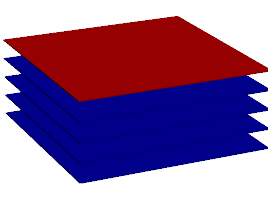
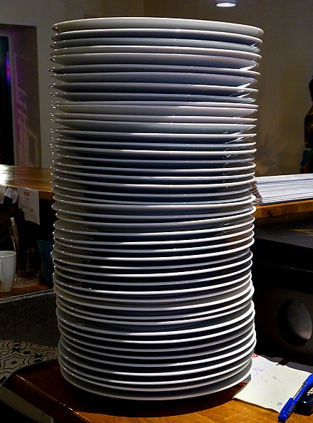

Algoritmos y Programación 2 - UNTREF

# Uso de Pilas

## Concepto

## Ejemplo

## Clase 

Material para la [Clase 6.2 Pila - Stack ](https://youtu.be/)

## Estructura de datos

![Pila][pila]

[pila]: http://upload.wikimedia.org/wikipedia/commons/thumb/d/d1/Pila.svg/391px-Pila.svg.png "Pila"